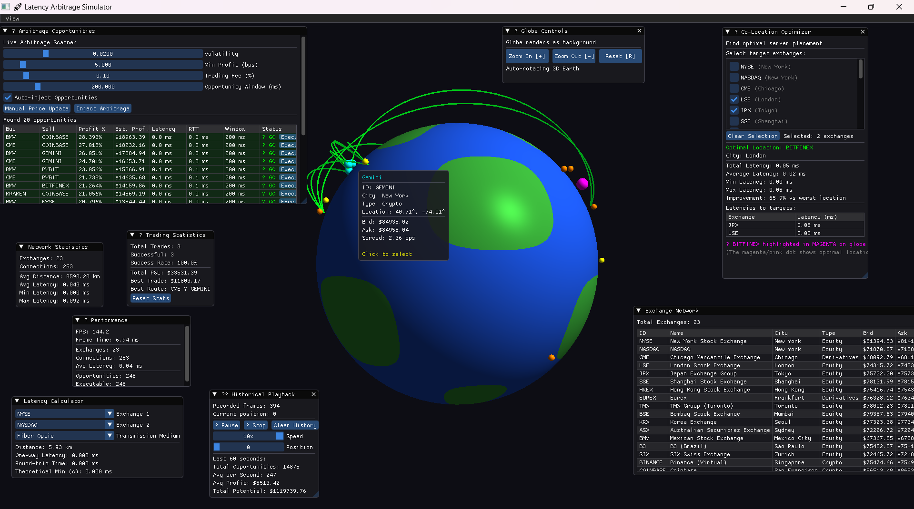

# 🌍 Global Latency Arbitrage Simulator

**Real-time visualization and analysis of high-frequency trading arbitrage opportunities across 23 global exchanges**


---

## 📖 Overview

A high-performance C++ application that models latency arbitrage opportunities in global financial markets by calculating speed-of-light network delays, identifying profitable trading routes, and visualizing everything on an interactive 3D globe. Built to demonstrate the critical importance of network topology and geographic proximity in high-frequency trading.

### Key Features

- **🌐 Interactive 3D Globe**: Real-time spinning Earth with 23+ exchange locations
- **⚡ Physics-Based Latency**: Speed-of-light calculations (fiber optic vs microwave)
- **💰 Arbitrage Detection**: Live scanning for profitable trading opportunities  
- **🎯 Co-Location Optimizer**: Find optimal server placement to minimize latency
- **📊 Historical Playback**: Record and replay 10 minutes of trading data
- **🔍 Advanced Analytics**: Network topology analysis and performance metrics

---

## 🎥 Demo



**Features Shown:**
- Real-time arbitrage opportunities across global exchanges
- 3D visualization of trade routes as glowing arcs
- Co-location optimization for server placement
- Historical data playback with controls
- Performance monitoring (FPS, latency stats)

---

## 🛠️ Technology Stack

| Component | Technology |
|-----------|-----------|
| **Language** | C++17 |
| **Graphics** | OpenGL 3.3+ |
| **UI Framework** | Dear ImGui |
| **Math Library** | GLM (OpenGL Mathematics) |
| **Networking** | Boost.Graph |
| **Build System** | CMake 3.15+ |
| **Compiler** | MSVC 2022 / GCC 9+ |

---

## 📦 Installation

### Prerequisites

- **Visual Studio 2022** (with C++ development tools)
- **CMake 3.15+**
- **vcpkg** (C++ package manager)
- **Git**

### Step 1: Install vcpkg

```powershell
# Clone vcpkg
cd C:\
git clone https://github.com/microsoft/vcpkg
cd vcpkg

# Bootstrap
.\bootstrap-vcpkg.bat

# Integrate with Visual Studio
.\vcpkg integrate install
```

### Step 2: Install Dependencies

```powershell
# Install required libraries
.\vcpkg install glfw3:x64-windows ^
                glm:x64-windows ^
                imgui[glfw-binding,opengl3-binding]:x64-windows ^
                opengl:x64-windows ^
                boost-graph:x64-windows ^
                nlohmann-json:x64-windows
```

### Step 3: Setup GLAD

1. Visit https://glad.dav1d.de/
2. Configure:
   - **Language**: C/C++
   - **Specification**: OpenGL
   - **GL Version**: 3.3
   - **Profile**: Core
3. Click **GENERATE** and download ZIP
4. Extract and copy:
   - `glad/include/glad/*` → `external/glad/include/glad/`
   - `glad/include/KHR/*` → `external/glad/include/KHR/`
   - `glad/src/glad.c` → `external/glad/src/`

### Step 4: Clone and Build

```powershell
# Clone repository
git clone https://github.com/YOUR_USERNAME/latency-arbitrage-simulator.git
cd latency-arbitrage-simulator

# Create build directory
mkdir build
cd build

# Configure with CMake
cmake .. -DCMAKE_TOOLCHAIN_FILE=C:/vcpkg/scripts/buildsystems/vcpkg.cmake

# Build
cmake --build . --config Release

# Run
cd Release
.\LatencyArbSimulator.exe
```

---

## 🎮 Usage

### Basic Controls

| Feature | Action |
|---------|--------|
| **Zoom In** | Click `[+]` button or scroll up |
| **Zoom Out** | Click `[-]` button or scroll down |
| **Reset Camera** | Click `[R]` button |
| **Select Exchange** | Click on colored dot on globe |
| **View Tooltip** | Hover mouse over exchange |

### UI Panels

#### 1. **Arbitrage Opportunities**
- Shows live profitable trading routes
- Green checkmark = Executable (latency < window)
- Click "Execute" to simulate trade

#### 2. **Co-Location Optimizer**
- Select 2+ target exchanges
- Click checkboxes to add/remove
- View optimal server location (highlighted in magenta)

#### 3. **Historical Playback**
- Records last 10 minutes of opportunities
- Play/Pause/Stop controls
- Adjustable playback speed (1x-10x)
- Seek to any point in time

#### 4. **Performance Metrics**
- Real-time FPS counter
- Network statistics
- Scanner performance

---

## 🏗️ Project Structure

```
latency-arbitrage-simulator/
├── external/
│   └── glad/                    # OpenGL loader
├── include/
│   ├── exchange.h               # Exchange data structures
│   ├── latency_calculator.h     # Haversine distance & speed-of-light
│   ├── network_graph.h          # Graph algorithms (Dijkstra)
│   ├── arbitrage_scanner.h      # Opportunity detection
│   ├── price_feed.h             # Mock price generator
│   ├── globe_renderer.h         # 3D OpenGL visualization
│   ├── colocation_optimizer.h   # Server placement optimization
│   └── historical_tracker.h     # Time-series data recording
├── src/
│   └── main.cpp                 # Entry point & UI
├── data/
│   └── exchanges.json           # 23 exchange locations
├── shaders/
│   ├── globe_vertex.glsl        # Globe vertex shader
│   ├── globe_fragment.glsl      # Globe fragment shader
│   ├── line_vertex.glsl         # Trade route vertex shader
│   └── line_fragment.glsl       # Trade route fragment shader
├── CMakeLists.txt
└── README.md
```

---

## 🧮 Technical Details

### Exchange Network

- **23 Global Exchanges**: NYSE, NASDAQ, LSE, JPX, SSE, HKEX, and more
- **3 Exchange Types**: Equity, Derivatives, Crypto
- **Real GPS Coordinates**: Accurate geographic positioning

### Latency Calculations

**Speed-of-Light Delays:**
- Fiber Optic: ~200,000 km/s (67% of c)
- Microwave: ~300,000 km/s (99% of c)

**Formula:**
```
latency = distance / (speed_of_light × medium_factor)
```

**Haversine Distance:**
```cpp
double haversine_distance(lat1, lon1, lat2, lon2) {
    dlat = lat2 - lat1
    dlon = lon2 - lon1
    a = sin²(dlat/2) + cos(lat1) × cos(lat2) × sin²(dlon/2)
    c = 2 × atan2(√a, √(1-a))
    return EARTH_RADIUS × c
}
```

### Arbitrage Detection

**Profitability Check:**
```
net_profit = (sell_price - buy_price) - fees - slippage
is_executable = (round_trip_time < opportunity_window)
```

**Scoring:**
```
score = profit_factor + latency_factor + window_factor
```

---

## 📊 Performance

- **Rendering**: 60+ FPS at 1920×1080
- **Exchanges**: 23 nodes
- **Connections**: 253 bidirectional edges
- **Opportunities**: 20+ scanned per second
- **History**: 600 snapshots (10 minutes)

---

## 🎓 Educational Value

### What This Demonstrates

1. **Network Topology Matters**: Geographic distance directly impacts profitability
2. **Speed-of-Light Limits**: Physical constraints on data transmission
3. **Co-Location Economics**: Why firms pay millions for proximity to exchanges
4. **Market Microstructure**: How HFT firms gain advantages through infrastructure

### Skills Demonstrated

- ✅ 3D Graphics Programming (OpenGL, GLSL)
- ✅ Graph Algorithms (Dijkstra, Network Analysis)
- ✅ Financial Modeling (Arbitrage, Latency)
- ✅ Geographic Calculations (Haversine, Spherical Geometry)
- ✅ Modern C++ (Smart Pointers, STL, Templates)
- ✅ Real-Time Systems (60 FPS rendering, event handling)

---

## 🚀 Future Enhancements

- [ ] Real cryptocurrency price feeds (Binance WebSocket API)
- [ ] Machine learning for opportunity prediction
- [ ] Historical market data replay
- [ ] Multi-asset arbitrage (cross-market)
- [ ] Network packet simulation
- [ ] Risk management module

---

## 📝 License

MIT License - See [LICENSE](LICENSE) file for details

---

## 🙏 Acknowledgments

- **Exchange Data**: Public exchange location data
- **Libraries**: GLFW, GLM, ImGui, Boost, nlohmann_json
- **Inspiration**: High-frequency trading research papers

---

## 📧 Contact

**Project Author**: Ranjan V 
**LinkedIn**: (https://www.linkedin.com/in/ranjan-001-v/)
**GitHub**: (https://github.com/Ranjan-V)

---

## ⭐ Star This Project!

If you found this project useful or interesting, please give it a star! ⭐

It helps others discover the project and motivates further development.

---

**Built with ❤️ for the intersection of finance, networking, and computer graphics**